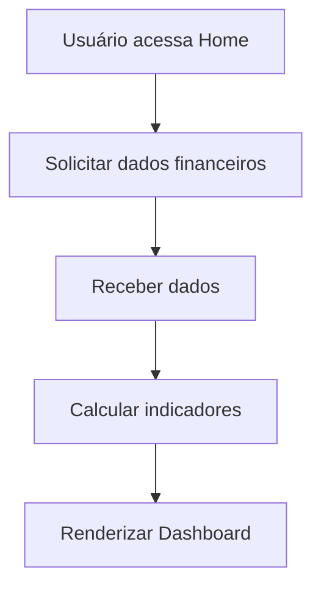

# FE-001 - Home Dashboard

## Visão Técnica

A Home será o ponto de entrada da aplicação contendo Header, Menu e Cards de indicadores financeiros.

## Fluxograma

## Componentes

- Header
- NavigationDrawer
- DashboardGrid
- DashboardCard
