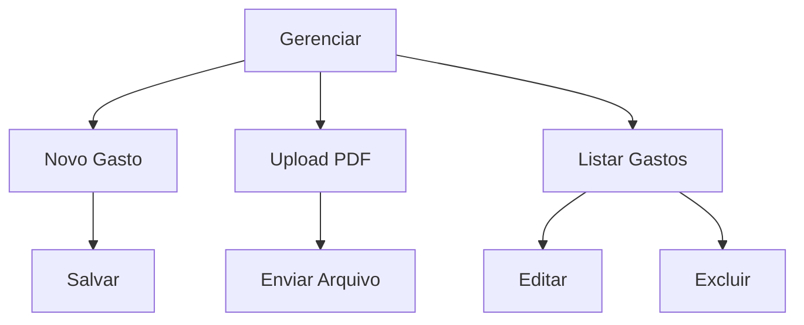

# FE-002 - Gerenciar Gastos

## Visão Técnica

Tela central para manutenção dos lançamentos financeiros.

## Fluxograma

## Componentes

- ExpenseForm
- ExpenseTable
- UploadInvoice
- ConfirmationModal
