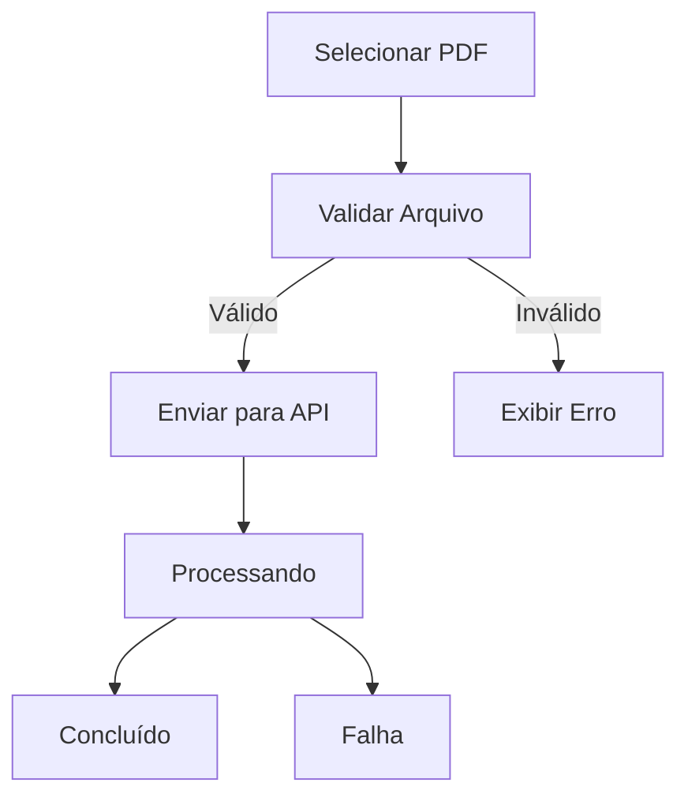

# FE-003 - Upload de Faturas

## Visão Técnica

Tela responsável pelo envio de faturas para processamento no backend.

## Fluxograma

## Componentes

- UploadArea
- UploadButton
- ProgressIndicator
- ErrorMessage
