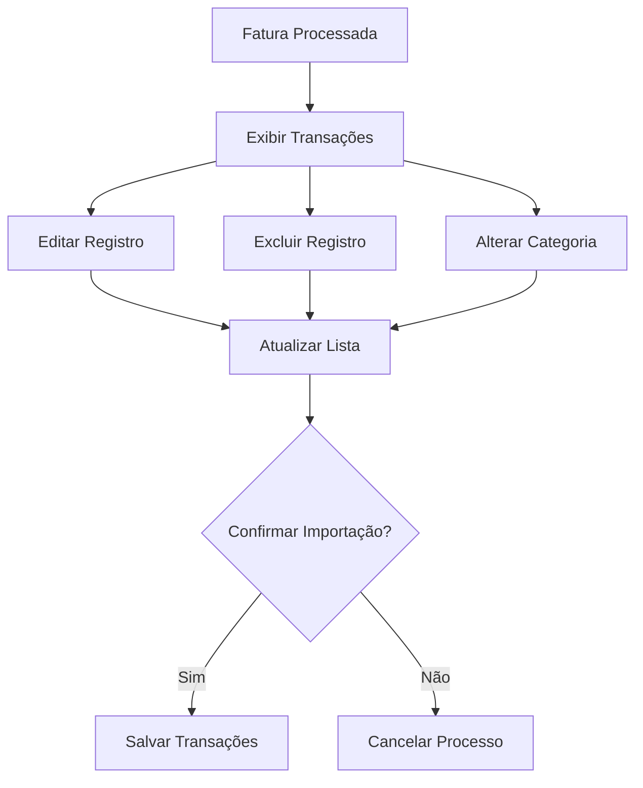

# plan-fe-004.md

# FE-004 - Revisão de Transações Extraídas

## Componentes

- ReviewTable
- TransactionRow
- CategorySelector
- SaveReviewButton
- CancelReviewButton

## Fluxograma

## Estados

- Loading
- Success
- Error
- Empty

## Responsividade

- Mobile: tabela com scroll horizontal
- Desktop: tabela completa
