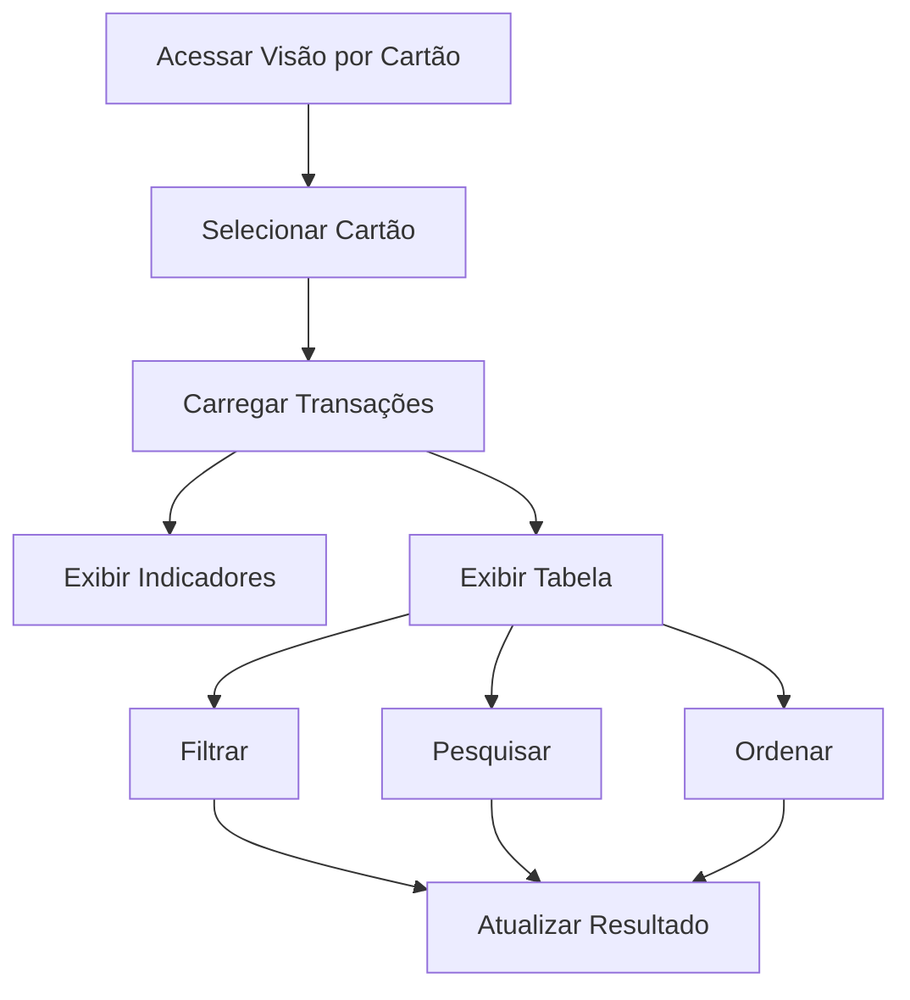

# plan-fe-006.md

# FE-006 - Visão por Cartão

## Estrutura

Tabela Financeira - {Nome do Cartão}

| Data | Categoria | Descrição | Valor |

## Componentes

- CardSelector
- CardSummary
- CardExpensesTable
- FiltersPanel
- SearchBar

## Fluxograma

