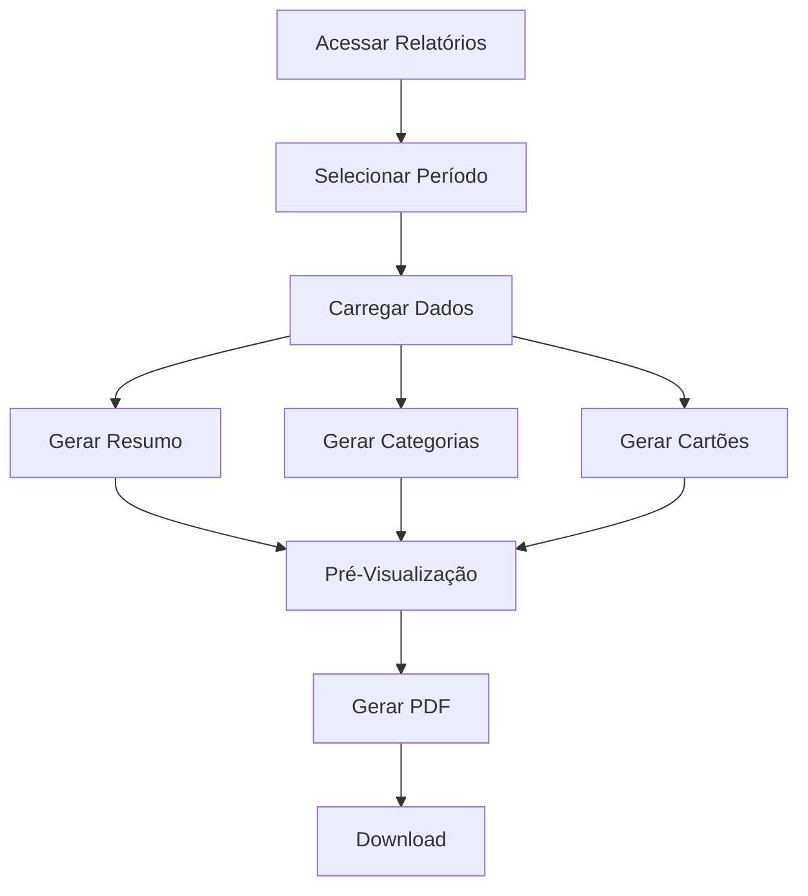

# plan-fe-007.md

# FE-007 - Gerar Relatórios

## Componentes

- ReportFilters
- ReportPreview
- ReportSummary
- ExportPdfButton

## Fluxograma

## Conteúdo do Relatório

- Resumo Financeiro
- Total Gasto
- Gastos por Categoria
- Gastos por Cartão
- Parcelas Futuras
- Despesas Fixas
