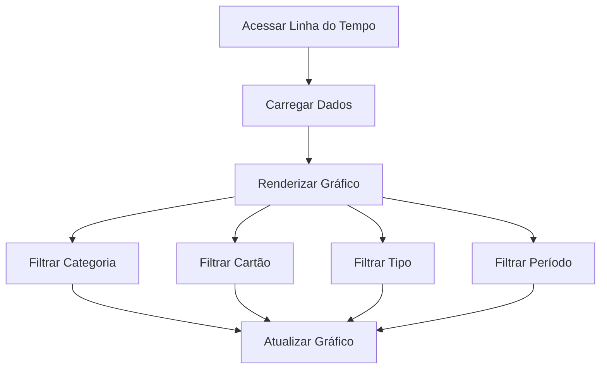

# plan-fe-008.md

# FE-008 - Linha do Tempo

## Componentes

- TimelineChart
- TimelineFilters
- SummaryCards
- DateRangeSelector

## Fluxograma

## Métricas

- Valor Total
- Média Mensal
- Gastos por Categoria
- Gastos por Cartão
